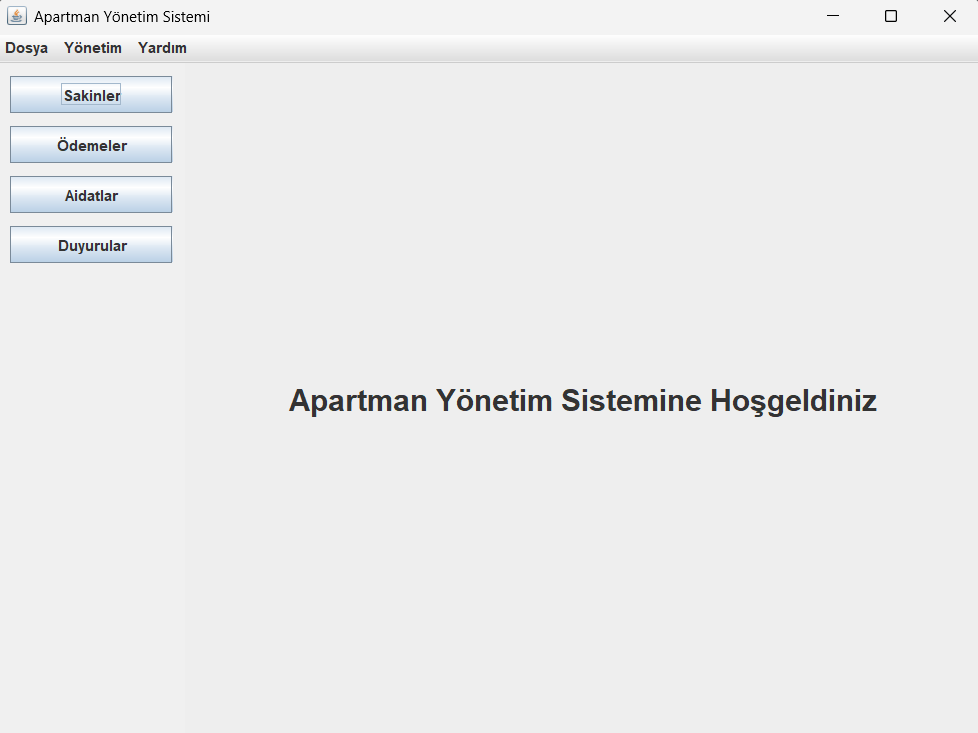
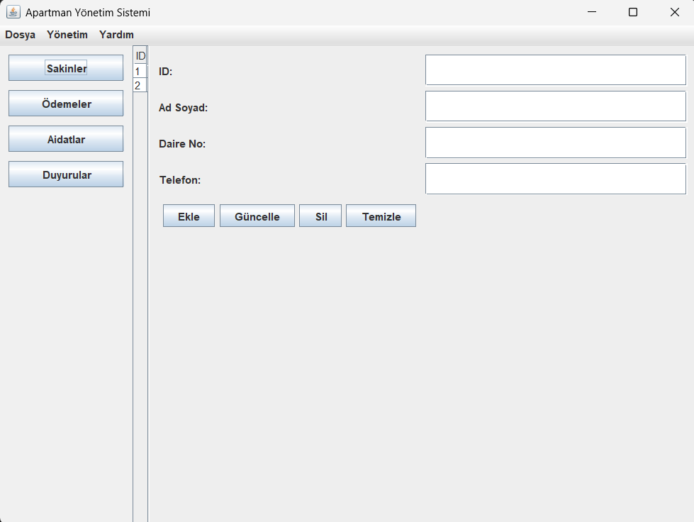
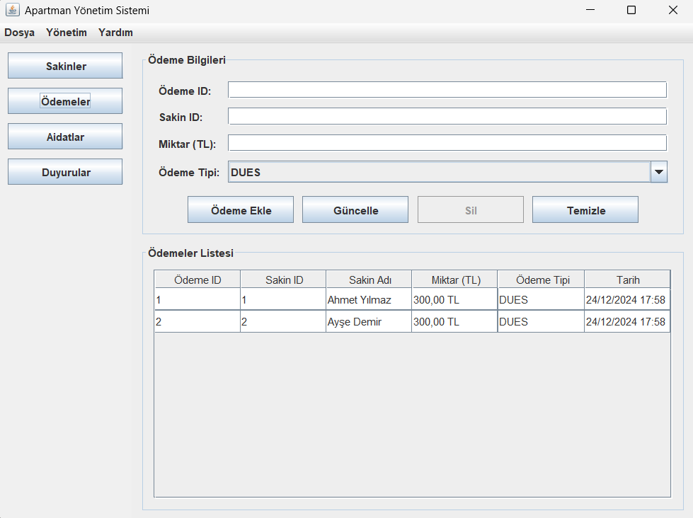
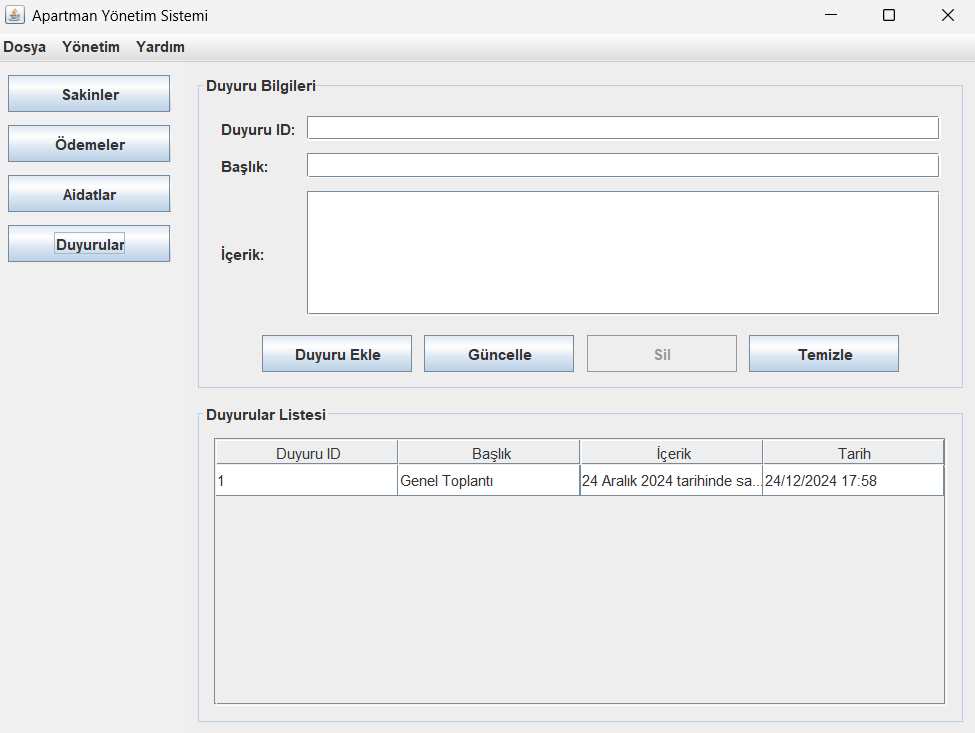

# Apartman Yönetim Sistemi

## 📋 Proje Hakkında
Apartman Yönetim Sistemi, apartman yöneticilerinin günlük yönetim işlerini kolaylaştırmak için tasarlanmış bir Java masaüstü uygulamasıdır. Bu sistem, apartman sakinlerinin bilgilerini, ödemeleri, aidatları ve duyuruları etkin bir şekilde yönetmeyi sağlar.

## 👥 Takım
- [Celil Şeref](https://github.com/celilseref)
- [Ayşe Gül Dal](https://github.com/ayseguldal)

## 🔧 Teknolojiler & Desenler
- Java
- Swing (GUI)
- Design Patterns:
  - Observer Pattern (Duyuru sistemi için)
  - State Pattern (Ödeme durumları için)
  - Factory Pattern (Nesne oluşturma için)
  - Singleton Pattern (ApartmentManager için)

## 🏗️ Mimari Yapı

### Observer Pattern
Duyuru sisteminde Observer pattern kullanılarak:
- Yeni duyurular eklendiğinde tüm sakinlere otomatik bildirim gönderimi
- Sakinler ve duyurular arasında gevşek bağlı bir ilişki
- Her sakinin duyuruları anlık takip edebilmesi sağlanmıştır

### State Pattern
Ödemelerin durum yönetimi State pattern ile sağlanarak:
- Ödemelerin Beklemede, Onaylandı ve Reddedildi durumları arasında geçişi
- Her durumun kendi davranış ve kurallarını yönetmesi
- Ödeme durumlarının sistemli bir şekilde takibi gerçekleştirilmiştir

### Factory Pattern
Nesnelerin oluşturulma süreci Factory pattern ile merkezi hale getirilerek:
- Ödeme ve duyuru nesnelerinin tutarlı bir şekilde oluşturulması
- Farklı türdeki ödemeler için özelleştirilmiş fabrika metodları
- Nesne oluşturma mantığının tek bir noktadan yönetimi sağlanmıştır

### Singleton Pattern
ApartmentManager sınıfı Singleton pattern ile tasarlanarak:
- Uygulama genelinde tek bir yönetici nesnesi
- Merkezi veri yönetimi
- Tutarlı nesne erişimi garanti edilmiştir

## 💻 Özellikler

- Uygulama Ana Ekranı
### 1. Sakinler Yönetimi

- Sakin ekleme, düzenleme ve silme
- Sakin bilgilerini görüntüleme
- Daire bazlı sakin listeleme

### 2. Ödemeler Yönetimi

- Ödeme kaydı oluşturma
- Ödeme durumu takibi
- Ödeme geçmişi görüntüleme
- Farklı ödeme türleri (Aidat, Bakım, Onarım)

### 3. Aidat Yönetimi

- Aidat miktarı belirleme
- Aidat ödeme takibi
- Aidat borç durumu görüntüleme
- Daire bazlı aidat raporlama

### 4. Duyuru Sistemi

- Duyuru oluşturma ve yönetme
- Otomatik bildirim sistemi
- Duyuru geçmişi görüntüleme

## 🚀 Kurulum

1. Projeyi klonlayın
2. Projeyi IDE'nizde açın (Eclipse, IntelliJ IDEA vb.)
3. Gerekli Java paketlerinin yüklü olduğundan emin olun
4. Uygulamayı çalıştırın

